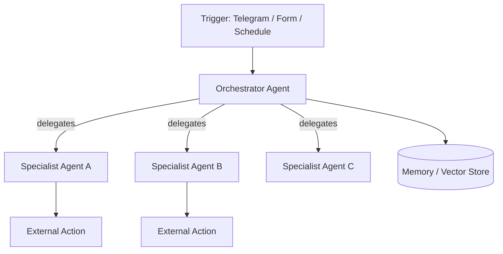

# Architecture

This document explains the design principles shared across the agents in this repository, and why they're built the way they are.

## 1. Why n8n

All agents are implemented as [n8n](https://n8n.io/) workflows rather than bespoke code. n8n gives us:

- **Visual, auditable pipelines** — every step (trigger, transform, LLM call, action) is a discrete node, which makes it easy to reason about what an agent can actually do, review it for safety, and hand it off to a non-engineer to maintain.
- **Native LLM + tool-calling support** via the LangChain nodes (`@n8n/n8n-nodes-langchain.*`), including agents, memory, vector stores, and tool-wrapped sub-workflows.
- **Built-in integrations** for Gmail, Google Calendar, Slack, Telegram, Google Sheets/Drive, and HTTP APIs, so agents can take real actions instead of only generating text.

## 2. Two agent patterns used in this repo

### Pattern A — Single-purpose pipeline agent
Used by: `ai-hr-recruitment-agent`, `ai-email-agent`

A linear (or lightly branched) pipeline: **trigger → normalize data → one or two LLM calls for classification/generation → deterministic branching (`IF` nodes) → action nodes**. These agents do one job end-to-end and are easy to test, monitor, and reason about failure modes for.

### Pattern B — Orchestrator + specialist sub-agents
Used by: `ai-multi-agent-orchestrator`, `ai-research-agent`, `ai-executive-assistant-agent`

A "manager" LLM agent is given a **toolbelt** of capabilities — some are native n8n nodes wrapped as tools (Slack, Google Sheets), others are entire sub-workflows exposed as callable tools (`@n8n/n8n-nodes-langchain.toolWorkflow`). The manager decides at runtime which tool(s) to invoke based on the user's request, rather than the flow being hard-coded.

This mirrors the standard **"router agent + specialist agents"** pattern used in production multi-agent systems: it keeps each specialist's prompt small and focused, makes it possible to swap or improve one specialist without touching the others, and keeps the orchestrator's own system prompt short enough to stay reliable.

## 3. Retrieval and memory

Where an agent needs context beyond a single message, we use one of:

- **Short-term conversational memory** — `memoryBufferWindow`, scoped per-session, so an agent can hold a coherent multi-turn conversation without re-fetching state every message.
- **Long-term / knowledge retrieval** — a Pinecone vector store queried through a `toolVectorStore` node, used for company-specific or domain knowledge that shouldn't live in the system prompt.

## 4. Decision gates over free-form generation

Wherever an agent needs to make a binary or categorical decision that drives a real-world action (send interview invite vs. rejection, reply vs. ignore, create calendar event vs. skip), the LLM is asked to return **structured JSON** and the actual branching is done by a deterministic `IF`/`Switch` node — not by the LLM freeform deciding "what to do next." This keeps agent behavior predictable and auditable, and keeps the LLM's job scoped to what it's actually good at: judgment and language generation, not control flow.

## 5. Error handling

Workflows that take consequential, hard-to-reverse actions (e.g. `ai-hr-recruitment-agent`, which emails real candidates and writes to an ATS) include a dedicated **error-trigger sub-flow**: failures are logged to a sheet and a human is notified via email/Slack, rather than failing silently. Simpler agents (`ai-research-agent`) use an explicit "try again" fallback branch on the agent node itself.

## 6. Credentials and secrets

No agent stores secrets in the workflow definition. All credentials (OAuth connections, API keys) are referenced by name/ID and resolved against the n8n instance's own credential store at runtime. See each project's `.env.example` for what needs to be configured.

## 7. Extending this repo

To add a new agent:

1. Create a new top-level folder following the `ai-<name>-agent` naming convention.
2. Add a `workflow/` folder with the exported `.json`.
3. Add a `README.md` following the same structure as the existing projects (overview, problem, features, architecture, setup, env vars, usage, future improvements).
4. Add a `.env.example` and `LICENSE`.
5. Add a row to the table in the root [`README.md`](./README.md) and a note in [`CHANGELOG.md`](./CHANGELOG.md).
