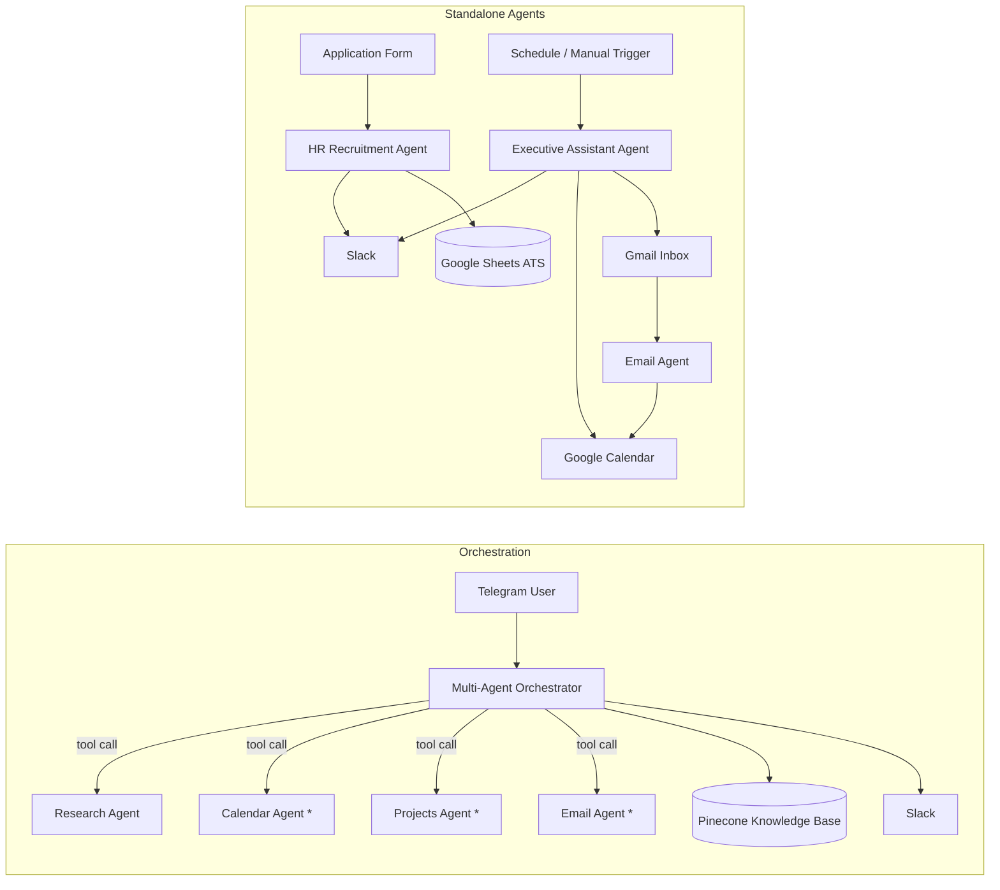

# 🤖 AI-Projects

**A portfolio of production-oriented AI agent workflows** — built with [n8n](https://n8n.io/), large language models (Claude, GPT, Gemini), and real-world integrations (Gmail, Google Calendar, Slack, Telegram, Google Sheets, Pinecone).

This repository collects five autonomous/semi-autonomous AI agents that automate day-to-day operational work: hiring, inbox triage, executive assistance, multi-agent orchestration, and research. Each agent is documented as a standalone project with its own architecture notes, setup guide, and workflow export so it can be understood, evaluated, or redeployed independently.

> Built and maintained by [**Maruthi**](https://github.com/Maruthi-builds). This repo is a living portfolio — expect it to grow as new agents are shipped.

---

## 📦 Projects

| Project | What it does | Core stack |
|---|---|---|
| [`ai-hr-recruitment-agent`](./ai-hr-recruitment-agent) | End-to-end candidate pipeline: intake form → resume parsing → AI scoring → interview/rejection emails → ATS tracking in Sheets | n8n, OpenAI, Google Drive/Sheets, Gmail, Slack |
| [`ai-email-agent`](./ai-email-agent) | Watches a Gmail inbox, classifies intent/priority, drafts human-sounding replies, and books calendar events for anything with a deadline | n8n, OpenAI, Gmail, Google Calendar |
| [`ai-executive-assistant-agent`](./ai-executive-assistant-agent) | A daily-driver assistant that triages email, tracks meeting notes (Fireflies), manages a to-do list, and responds over Slack | n8n, Claude (Anthropic), Gmail, Google Calendar, Slack, Google Sheets |
| [`ai-multi-agent-orchestrator`](./ai-multi-agent-orchestrator) | A Telegram-based "manager" agent that routes requests to specialist sub-agents (calendar, email, research, projects) and a Pinecone-backed knowledge base | n8n, Gemini, Pinecone (RAG), Telegram, Slack, Google Sheets |
| [`ai-research-agent`](./ai-research-agent) | A callable research sub-agent that answers questions using Wikipedia, Hacker News, and SerpAPI, with graceful fallback between sources | n8n, Gemini, Wikipedia, Hacker News API, SerpAPI |

Each folder is self-contained: import the workflow into n8n, configure the environment variables listed in its README, and it runs.

---

## 🧠 How these agents relate

`ai-multi-agent-orchestrator` is the "hub" agent — it receives messages over Telegram and delegates to other agents (including `ai-research-agent`) as callable sub-workflows/tools, rather than doing everything in one giant prompt. The other three projects (`ai-hr-recruitment-agent`, `ai-email-agent`, `ai-executive-assistant-agent`) are independent, purpose-built agents that can run standalone.



<sup>* Calendar Agent and Projects Agent are referenced by the orchestrator as external sub-workflows in the original build; they are not included as standalone exports in this repository. See [`ai-multi-agent-orchestrator/README.md`](./ai-multi-agent-orchestrator/README.md) for details on wiring them up.</sup>

---

## 🛠 Tech stack

- **Orchestration engine:** [n8n](https://n8n.io/) (self-hosted or cloud)
- **LLMs:** Anthropic Claude, OpenAI GPT, Google Gemini — chosen per-agent based on task fit
- **Retrieval:** Pinecone (vector store) for RAG-based knowledge lookup
- **Integrations:** Gmail, Google Calendar, Google Drive, Google Sheets, Slack, Telegram, Fireflies.ai, SerpAPI, Wikipedia, Hacker News

## 🚀 Getting started

1. Clone this repository.
2. Pick a project folder and open its `README.md` for setup instructions.
3. Import the workflow JSON from that project's `workflow/` folder into your n8n instance (**Workflows → Import from File**).
4. Configure credentials and environment variables as listed in the project's `.env.example`.
5. Activate the workflow.

General n8n setup:

```bash
# Self-hosted via Docker
docker run -it --rm \
  --name n8n \
  -p 5678:5678 \
  -v ~/.n8n:/home/node/.n8n \
  n8nio/n8n
```

Or use [n8n Cloud](https://n8n.io/cloud/) if you'd rather skip self-hosting.

## 📁 Repository structure

```text
AI-Projects/
│
├── README.md                     ← you are here
├── ARCHITECTURE.md               ← design principles behind the agents
├── CONTRIBUTING.md               ← how to propose changes
├── CHANGELOG.md                  ← version history
├── LICENSE                       ← MIT
├── .gitignore
│
├── ai-hr-recruitment-agent/
├── ai-email-agent/
├── ai-executive-assistant-agent/
├── ai-multi-agent-orchestrator/
└── ai-research-agent/
```

## 🔒 A note on credentials

The workflow JSON files in this repo are **exported from n8n and contain credential *references* (names/IDs), not secrets**. No API keys, tokens, or passwords are stored in this repository. After importing a workflow, you will need to reconnect each credential (Gmail, Slack, OpenAI, etc.) inside your own n8n instance. See each project's README for the full list of required environment variables and OAuth scopes.

## 📄 License

This project is licensed under the [MIT License](./LICENSE) — free to use, modify, and adapt with attribution.

## 📬 Contact

Interested in AI automation, agentic workflows, or a custom build? Reach out via [GitHub](https://github.com/Maruthi-builds).
