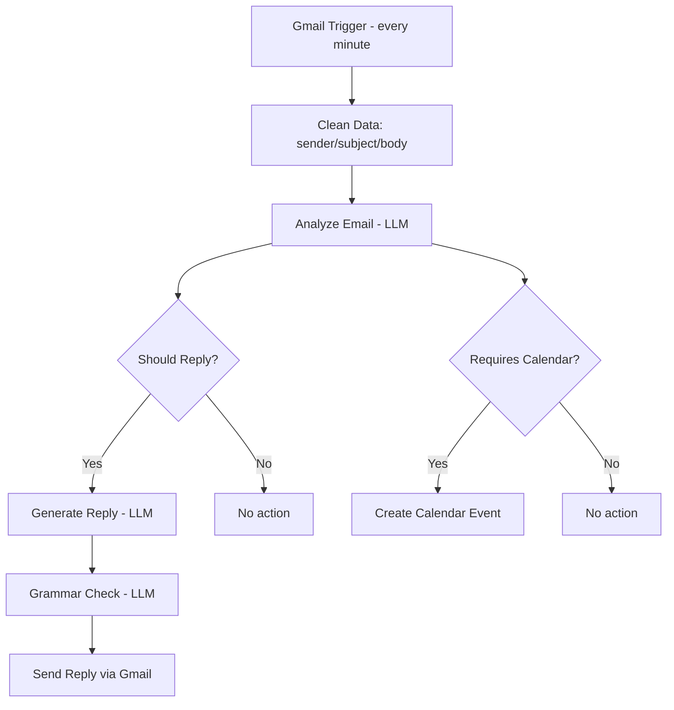

# 📧 AI Email Agent

An always-on Gmail triage agent: it reads every new email, classifies it, drafts a natural-sounding reply when one is warranted, and creates calendar events automatically when an email implies a deadline.

---

## Overview

This agent polls a Gmail inbox every minute, analyzes each new message with an LLM to extract intent, priority, category, and any deadlines, and takes action accordingly — replying automatically where appropriate, and creating a calendar event when the email requires one. It's designed as a lightweight personal/executive inbox assistant rather than a full support-desk system.

## Problem it solves

Inboxes are a constant low-grade tax on attention: most emails need a quick acknowledgment or routine reply, some need a calendar entry, and only a few genuinely need a human's judgment. This agent handles the routine cases automatically and consistently, so time is spent only on the emails that actually need it.

## Features

- ⏱️ **Near real-time inbox polling** — checks Gmail every minute via a trigger.
- 🧹 **Data normalization** — extracts sender, subject, and plain-text body into a clean, consistent shape.
- 🧠 **AI email analysis** — a single LLM call classifies each email and returns structured JSON: intent, priority (`high`/`medium`/`low`), category (`urgent`/`finance`/`clients`/`spam`/`other`), recommended action (`reply`/`ignore`), a summary, extracted deadlines, and whether a calendar entry is needed.
- 🔀 **Deterministic routing** — an `IF` node (not the LLM) decides whether to proceed to reply-generation, based on the `action` field.
- ✍️ **Human-sounding reply generation** — a dedicated LLM call drafts a natural, non-robotic reply based on the email and its summary.
- ✅ **Grammar/spelling pass** — replies go through a second LLM call to clean up grammar before sending.
- 📤 **Automatic sending** via Gmail, with the original subject prefixed `Re:`.
- 📅 **Conditional calendar event creation** — when the analysis step flags `requires_calendar: true`, an event is created on Google Calendar using the extracted deadline.

## Workflow / Architecture

The `Analyze Email` step returns a single structured JSON object that drives **two independent branches** — the reply path and the calendar path — so a single email can trigger both, either, or neither, depending on its content.

## Setup

1. **Import the workflow** — `Workflows → Import from File` → [`workflow/email-agent-workflow.json`](./workflow/email-agent-workflow.json).
2. **Connect Gmail OAuth2 credentials** (used by both the trigger and the send-reply node).
3. **Connect an OpenAI credential** for the analysis, reply-generation, and grammar-check nodes.
4. **Connect Google Calendar OAuth2 credentials** for the conditional event-creation node.
5. **Review the analysis prompt** in `Analyze Email` and adjust the `category` list to match how you want your own inbox segmented.
6. **Review the reply-generation prompt** in `Generate Reply` — tone and constraints ("no AI mention", "natural tone") can be tuned to your voice.
7. **Set the target calendar** in `Create Calendar Event` (defaults to a placeholder calendar in the export — point this at your own).
8. **Activate the workflow.**

> ⚠️ Because this agent can send real emails automatically, test it against a non-critical inbox first, and consider starting with the reply branch disabled until you trust its output.

## Environment variables / credentials

See [`.env.example`](./.env.example). Summary:

| Variable | Purpose |
|---|---|
| `GMAIL_OAUTH_CLIENT_ID` / `SECRET` | Reading and sending email |
| `OPENAI_API_KEY` | Email analysis, reply generation, grammar check |
| `GOOGLE_CALENDAR_OAUTH_CLIENT_ID` / `SECRET` | Creating deadline-driven calendar events |

## Usage

Once active, the agent runs unattended:

1. New email arrives → analyzed within a minute.
2. If it warrants a reply, a draft is generated, grammar-checked, and sent automatically.
3. If it implies a deadline, a calendar event is created without any manual step.

No end-user interaction is required — this is a background automation, not a chat interface.

## Future improvements

- [ ] Add a "draft only" mode (save to Gmail Drafts instead of auto-sending) for a human-review step.
- [ ] Expand categories and route different categories to different reply strategies or teams.
- [ ] Add sender allow/deny lists to avoid auto-replying to spam or automated senders.
- [ ] Use a proper embeddings/reranking model for the analysis step instead of a general chat completion, for more consistent classification.
- [ ] Add conversation threading awareness so replies account for prior messages in a thread, not just the latest one.
- [ ] Log every decision (reply/ignore/calendar) to a sheet for auditability and quality review.

## License

Released under the [MIT License](./LICENSE).
