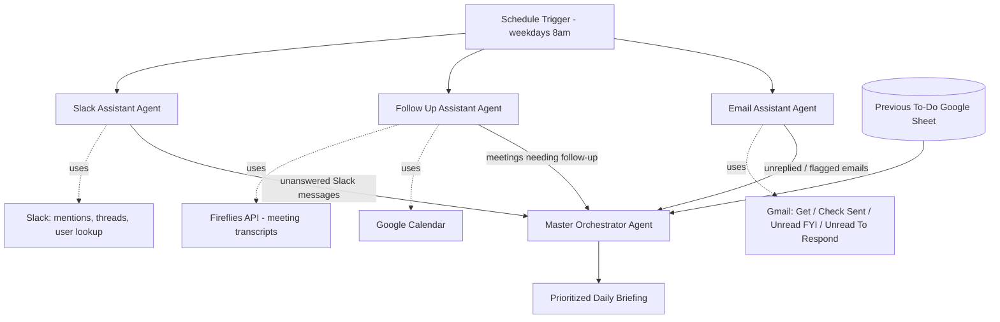

# 🗂️ AI Executive Assistant Agent

A Claude-powered daily executive assistant that triages email, tracks meeting follow-ups, monitors Slack, and produces a single prioritized daily briefing — coordinated by a master orchestrator agent.

---

## Overview

This agent runs on a schedule (weekday mornings) and coordinates three specialist sub-agents — an Email Assistant, a Follow-Up Assistant, and a Slack Assistant — each responsible for scanning one channel of communication. A Master Orchestrator Agent then synthesizes all three reports, cross-references them against an existing to-do list in Google Sheets, and produces one prioritized, actionable daily briefing.

## Problem it solves

Staying on top of email, meeting follow-ups, and Slack simultaneously means constant context-switching, and it's easy for a commitment made in one channel (e.g. "I'll send that over" in a meeting) to fall through the cracks because it's never captured anywhere. This agent treats "what needs my attention today" as a single synthesis problem instead of three separate inboxes, and produces one ranked list instead of three unread badges.

## Features

- 📅 **Scheduled daily run** — triggers automatically on weekday mornings (default: 8am, Mon–Fri).
- 📧 **Email triage sub-agent** — scans for unreplied emails, flags by urgency (High/Medium/Low), and specifically watches for messages tied to active sales leads, partnerships, and VIP contacts.
- 🔁 **Meeting follow-up sub-agent** — pulls the last 3 days of calendar meetings, cross-references meeting notes (via a Fireflies.ai transcript fetch), and flags meetings that still need a follow-up action.
- 💬 **Slack monitoring sub-agent** — checks DMs and channel mentions for messages that haven't been replied to yet, and pulls related email context to help prioritize.
- 🧠 **Master Orchestrator Agent** — synthesizes all three sub-agent reports plus a running Google Sheets to-do list into one prioritized daily briefing.
- 🧵 **Short-term memory** (buffer window) so each agent run has coherent context without needing to reprocess history from scratch.
- 🤝 **Multi-model setup** — Anthropic Claude models power each specialist agent.

## Workflow / Architecture

Each specialist agent is a separate `agent` node with its own system prompt and its own scoped toolset (Gmail tools, Calendar, Slack tools, or the Fireflies HTTP call), so each one stays focused on a single channel. The orchestrator only ever sees their *outputs* — the synthesized reports — not the raw tool calls.

## Setup

1. **Import the workflow** — `Workflows → Import from File` → [`workflow/executive-assistant-workflow.json`](./workflow/executive-assistant-workflow.json).
2. **⚠️ Personalize the system prompts first.** The exported workflow's agent prompts (`Email Assistant`, `Follow Up Assistant`, `Master Orchestrator Agent`, `Slack Assistant`) were originally written for a specific person and company — they contain a hardcoded name, email address, and Slack user ID that are **not placeholders**. Before running (and especially before publishing this repo publicly), replace those with your own name, email, and Slack member ID, or genericize them with template variables.
3. **Connect credentials**: Gmail OAuth2, Google Calendar OAuth2, Slack OAuth2, Google Sheets OAuth2, and an Anthropic API key.
4. **Set up the "Previous To Do" Google Sheet** that the orchestrator reads from and writes back to.
5. **Configure the Fireflies API** (or remove that node if you don't use Fireflies for meeting transcription) — it's called via a plain HTTP request node, so any transcript source could be substituted.
6. **Adjust the schedule trigger** to your preferred run time/days.
7. **Activate the workflow.**

## Environment variables / credentials

See [`.env.example`](./.env.example). Summary:

| Variable | Purpose |
|---|---|
| `ANTHROPIC_API_KEY` | Powers all four agent nodes (Claude) |
| `GMAIL_CLIENT_ID` / `SECRET` | Email triage sub-agent |
| `GOOGLE_CALENDAR_CLIENT_ID` / `SECRET` | Meeting follow-up sub-agent |
| `GOOGLE_SHEETS_CLIENT_ID` / `SECRET` | To-do list read/write |
| `SLACK_BOT_TOKEN` | Slack monitoring + sending |
| `FIREFLIES_API_KEY` | Meeting transcript retrieval |

## Usage

This agent is designed to run unattended on a schedule and deliver a daily briefing (via Slack message and/or the orchestrator's output) rather than being invoked interactively. To use it:

1. Personalize and activate the workflow (see Setup above).
2. Let it run on its schedule — no manual trigger needed day-to-day.
3. Read the Master Orchestrator's output each morning as your prioritized to-do list.
4. It can also be triggered manually (via n8n's manual trigger) to get an on-demand briefing.

## Future improvements

- [ ] Parameterize the person/company details (name, email, Slack ID, company priorities) as workflow variables instead of hardcoded prompt text.
- [ ] Add a persistence layer for the daily briefing itself (currently synthesized fresh each run — no historical record).
- [ ] Add a feedback loop where marking a to-do "done" removes it from the next day's briefing automatically.
- [ ] Support multiple recipients/profiles from a single workflow.
- [ ] Add Slack or email delivery of the final briefing directly, rather than leaving it as workflow output only.
- [ ] Replace the Fireflies HTTP call with a dedicated node/credential type for cleaner error handling.

## License

Released under the [MIT License](./LICENSE).
