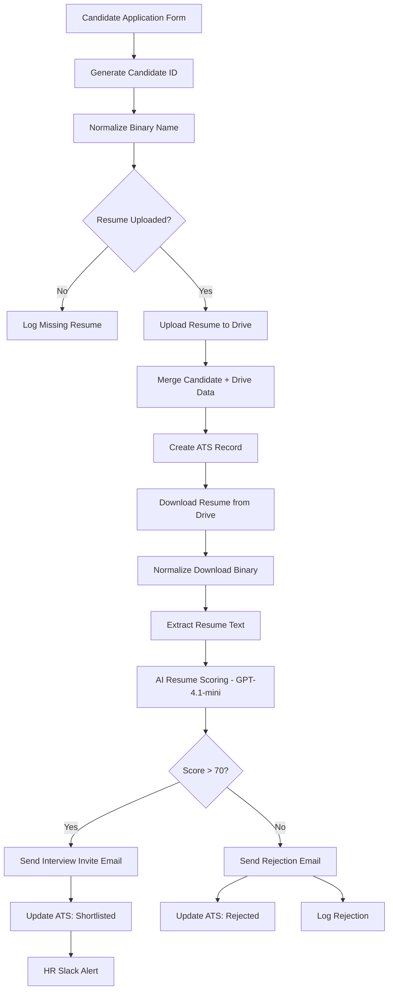
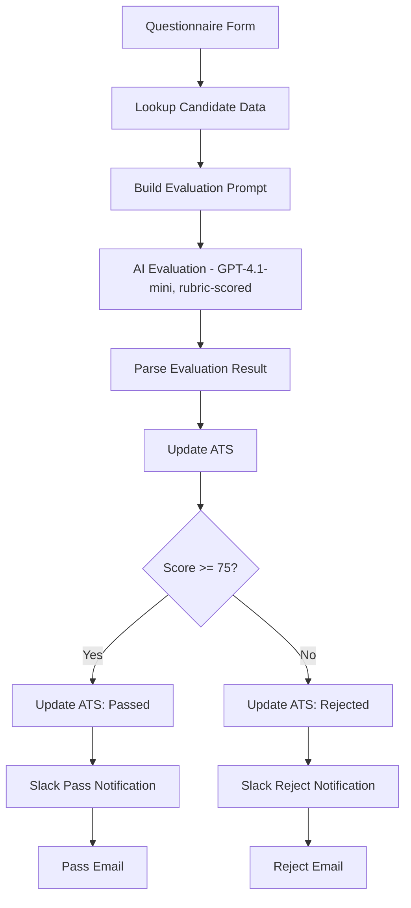
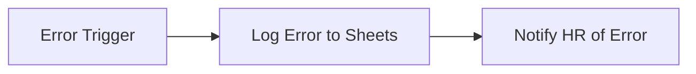

# 🧑‍💼 AI HR Recruitment Agent

An end-to-end, two-stage hiring pipeline that takes a candidate from **application form** to **shortlist decision**, with AI-driven resume screening and technical evaluation at each gate — fully automated, with a human-in-the-loop escalation path for errors.

---

## Overview

This agent automates the early-to-mid stages of a technical hiring pipeline for a Software Engineer role. It ingests applications through a form, screens resumes with an LLM, tracks every candidate in a Google Sheets–based ATS, sends interview/rejection emails automatically, and then runs a second AI-scored technical questionnaire stage before a final pass/reject decision — all without a recruiter touching a spreadsheet.

## Problem it solves

Manually screening resumes and running first-pass technical evaluations doesn't scale: recruiters spend hours reading resumes that don't meet the bar, candidates wait days for a response, and tracking status across email threads and spreadsheets is error-prone. This agent compresses that into a consistent, auditable, always-on pipeline — every candidate gets a fast, structured evaluation and a timely response, and every decision is logged.

## Features

- 📝 **Form-based intake** with resume upload (PDF), validated before processing continues.
- 🆔 **Automatic candidate ID generation** and ATS record creation in Google Sheets.
- 📄 **Resume storage & text extraction** via Google Drive, with binary normalization to handle upload quirks.
- 🤖 **AI resume scoring** (GPT-4.1-mini) — returns a structured score (0–100), summary, strengths, weaknesses, and a recommended pipeline stage.
- 🚪 **Deterministic decision gate** — score > 70 routes to interview invite; otherwise, rejection — decision logic lives in an `IF` node, not the LLM's free text.
- 📧 **Automatic candidate emails** — interview invite or rejection, personalized per outcome.
- 📊 **Live ATS updates** — shortlisted/rejected status written back to Google Sheets automatically.
- 📣 **Slack alerts to HR** for shortlisted candidates.
- 🧪 **Stage 2: technical questionnaire** — a second form with 5 open-ended technical questions (20 marks each), auto-graded by an LLM against a detailed rubric.
- ✅ **Second decision gate** (score ≥ 75) — routes to pass/reject with corresponding email + Slack notifications.
- 🛟 **Dedicated error-handling branch** — any workflow failure is logged to a sheet and HR is notified by email, and missing resumes are logged separately, so nothing fails silently.

## Workflow / Architecture

**Stage 1 — Resume screening**

**Stage 2 — Technical questionnaire evaluation**

**Error handling (parallel branch)**

## Setup

1. **Import the workflow** — in n8n: `Workflows → Import from File` → select [`workflow/hr-recruitment-workflow.json`](./workflow/hr-recruitment-workflow.json).
2. **Create the Google Sheet ATS** with columns matching: candidate ID, name, email, phone, LinkedIn/portfolio URLs, resume link, score, summary, strengths, weaknesses, recommended stage, questionnaire score, final status.
3. **Set up a Google Drive folder** for resume storage and connect Google Drive OAuth credentials.
4. **Connect credentials** in n8n for: Google Forms/Trigger, Google Drive, Google Sheets, Gmail, Slack, and OpenAI.
5. **Customize the two form triggers** (`01 | Candidate Application Form`, `19 | Questionnaire Form`) — field labels, required fields, and questionnaire questions/rubric can be adapted to your role.
6. **Review and tune the score thresholds** in `13 | Score Decision Gate` (default: `> 70`) and `26 | Questionnaire Decision` (default: `>= 75`) to match your bar.
7. **Activate the workflow.**

## Environment variables / credentials

See [`.env.example`](./.env.example) for the full list. In summary, this workflow needs:

| Variable | Purpose |
|---|---|
| `OPENAI_API_KEY` | Resume scoring and questionnaire evaluation (GPT-4.1-mini) |
| `GOOGLE_DRIVE_OAUTH_CLIENT_ID` / `SECRET` | Resume storage & retrieval |
| `GOOGLE_SHEETS_OAUTH_CLIENT_ID` / `SECRET` | ATS tracking |
| `GMAIL_OAUTH_CLIENT_ID` / `SECRET` | Interview invite / rejection / pass / reject emails |
| `SLACK_OAUTH_TOKEN` | HR notifications and pass/reject alerts |

> These are configured as n8n **credentials**, not raw `.env` values — the `.env.example` file documents what each credential needs, for reference when setting up OAuth apps.

## Usage

1. Share the application form URL (generated by n8n's Form Trigger) with candidates.
2. The pipeline runs automatically on submission — no manual intervention needed for Stage 1.
3. Shortlisted candidates receive an interview invite email containing (or followed by) the link to the technical questionnaire form.
4. Once the questionnaire is submitted, Stage 2 runs automatically and produces a final pass/reject decision.
5. Monitor the ATS Google Sheet for a live view of every candidate's status and score.

## Future improvements

- [ ] Support multiple job requisitions/roles from a single workflow (parameterized rubric per role).
- [ ] Add a human-approval step before auto-sending rejection emails (soft-launch safety net).
- [ ] Integrate a real ATS (Greenhouse, Lever) instead of Google Sheets for larger hiring volumes.
- [ ] Add resume-to-JD semantic matching (embeddings) as an additional signal alongside the LLM score.
- [ ] Add automatic interview scheduling (calendar link generation) on the invite email.
- [ ] Add bias/consistency auditing — periodic sampling of AI decisions for human QA review.

## License

Released under the [MIT License](./LICENSE) — see the file for details. This license applies to the workflow definition and documentation in this folder; it does not grant rights to any third-party services (OpenAI, Google, Slack) it integrates with.
