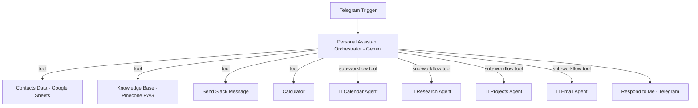

# 🕸️ AI Multi-Agent Orchestrator

A Telegram-based "manager" agent that routes requests to specialist sub-agents — calendar, email, research, and projects — plus a Pinecone-backed knowledge base, instead of trying to do everything in one prompt.

---

## Overview

This is the router/hub agent of the portfolio: a single Telegram bot conversation that, behind the scenes, delegates work to purpose-built sub-agents exposed as callable tools. Ask it to schedule something, and it hands off to a Calendar Agent; ask it a factual question, and it hands off to the [Research Agent](../ai-research-agent); ask it to message someone or look up a contact, and it uses the appropriate tool directly. The user only ever talks to one bot.

## Problem it solves

A single LLM prompt trying to handle calendar management, email, research, project tracking, contact lookup, and Slack messaging all at once tends to get unreliable — the system prompt grows unwieldy and the model's tool selection gets noisy. This agent solves that with a **router pattern**: one lean orchestrator prompt whose only job is "understand the request and pick the right tool," while each specialist agent keeps its own focused prompt and toolset.

## Features

- 💬 **Single conversational entry point** via Telegram — no need to know which "agent" to talk to.
- 🧭 **LLM-driven tool routing** — the orchestrator (Gemini) decides at runtime which sub-agent or tool to call based on the request.
- 🗓️ **Calendar Agent** (sub-workflow tool) — handles scheduling and calendar actions.
- 🔎 **Research Agent** (sub-workflow tool) — see [`ai-research-agent`](../ai-research-agent) in this repo; answers factual/research questions via Wikipedia → Hacker News → SerpAPI.
- 📁 **Projects Agent** (sub-workflow tool) — takes actions on and retrieves information about ongoing projects.
- 📧 **Email Agent** (sub-workflow tool) — handles email actions.
- 📇 **Contacts lookup tool** — pulls contact info (email, phone) from a Google Sheets contact database before taking actions that need it.
- 📚 **Knowledge Base tool** — Pinecone-backed vector store (RAG) for company-specific knowledge, queried as a tool rather than stuffed into the prompt.
- 💬 **Slack messaging tool** — lets the orchestrator send Slack messages directly when asked.
- 🧮 **Calculator tool** for quick numeric work.
- 🧠 **Dual LLM setup** — Gemini for the main orchestrator and knowledge-base retrieval, OpenAI configured as an available (optional) model.

## Workflow / Architecture

The orchestrator's system prompt explicitly tells it what each tool is for and when to use it (e.g., "use Contacts Data *before* sending an email or getting emails"), which keeps tool selection grounded rather than left entirely to model judgment.

> **Note on sub-agents:** `Calendar Agent` and `Projects Agent` are referenced in this workflow as external sub-workflows (by their original n8n workflow IDs) but are not included as standalone exports in this repository — only `Email Agent` and `Research Agent` correspond to other projects here ([`ai-email-agent`](../ai-email-agent), [`ai-research-agent`](../ai-research-agent)). To fully reproduce this orchestrator, you'll need to build (or source) equivalent Calendar and Projects sub-workflows and re-point the `toolWorkflow` nodes at your own workflow IDs after import.

## Setup

1. **Import this workflow first**, then import (or build) the sub-workflows it calls: [`ai-email-agent`](../ai-email-agent), [`ai-research-agent`](../ai-research-agent), plus your own Calendar and Projects agents.
2. **Re-point the `toolWorkflow` nodes** (`🤖Calendar_Agent`, `🤖Research_Agent`, `🤖Projects_Agent`, `🤖___Email_Agent`) to the actual workflow IDs in your n8n instance — these are instance-specific and won't resolve after import until updated.
3. **Set up a Telegram bot** via [@BotFather](https://t.me/BotFather) and connect the Telegram credential.
4. **Connect a Google Gemini API credential** for the orchestrator and knowledge-base retrieval models.
5. **Set up Pinecone** — create an index (this workflow expects one named for your knowledge base) and connect the Pinecone credential, plus a Gemini embeddings credential.
6. **Connect Google Sheets** for the contacts database, and **Slack OAuth2** for the messaging tool.
7. **Review the orchestrator's system prompt** and update tool descriptions if you rename or add tools.
8. **Activate the workflow.**

## Environment variables / credentials

See [`.env.example`](./.env.example). Summary:

| Variable | Purpose |
|---|---|
| `TELEGRAM_BOT_TOKEN` | Bot entry point and response delivery |
| `GOOGLE_GEMINI_API_KEY` | Orchestrator LLM + knowledge-base retrieval LLM |
| `OPENAI_API_KEY` | Optional alternate model for the orchestrator |
| `PINECONE_API_KEY` / `PINECONE_INDEX` | Knowledge base vector store |
| `GOOGLE_SHEETS_CLIENT_ID` / `SECRET` | Contacts database |
| `SLACK_BOT_TOKEN` | Slack messaging tool |
| `CALENDAR_AGENT_WORKFLOW_ID`, `PROJECTS_AGENT_WORKFLOW_ID`, `EMAIL_AGENT_WORKFLOW_ID`, `RESEARCH_AGENT_WORKFLOW_ID` | n8n workflow IDs for each sub-agent tool |

## Usage

1. Message your Telegram bot directly.
2. Ask naturally — e.g., "What's on my calendar tomorrow?", "Look up Jane's email and send her a follow-up", "What's the latest on the Q3 project?", "Search for recent news on X."
3. The orchestrator picks the right tool(s) automatically and replies in the same Telegram thread.

## Future improvements

- [ ] Export and include the Calendar Agent and Projects Agent as standalone sub-projects in this repo, matching the pattern used for Research and Email.
- [ ] Add conversation-level memory so the orchestrator retains context across multiple Telegram messages, not just within a single tool-calling turn.
- [ ] Add an explicit confirmation step before any tool call that sends a message or modifies external state (email, Slack, calendar).
- [ ] Add usage/cost logging per tool call to track which sub-agents are used most.
- [ ] Support additional channels beyond Telegram (e.g., WhatsApp, Slack DM) as alternate triggers into the same orchestrator.

## License

Released under the [MIT License](./LICENSE).
