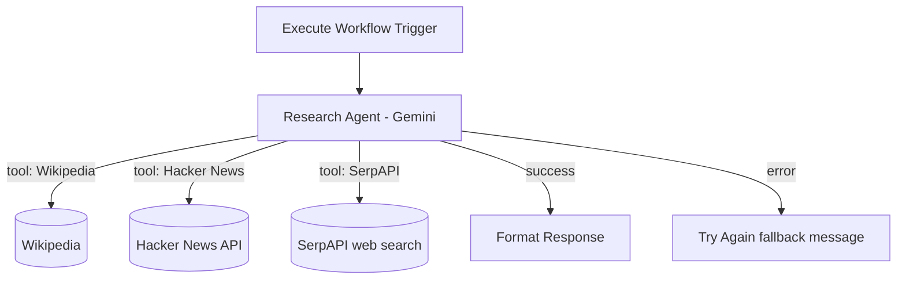

# 🔎 AI Research Agent

A callable research sub-agent that answers factual questions by searching Wikipedia first, falling back to Hacker News, and finally to a general web search via SerpAPI — with an explicit success/failure output contract so it can be safely used as a tool by other agents.

---

## Overview

This agent is designed to be **called by other workflows**, not used standalone through a chat UI. It receives a question via n8n's Execute Workflow trigger, researches an answer using a small, ordered toolset, and returns a clean `response` field either way — a real answer on success, or a graceful fallback message on failure — so calling agents (like [`ai-multi-agent-orchestrator`](../ai-multi-agent-orchestrator)) always get a predictable shape back.

## Problem it solves

General-purpose assistant agents are worse at research than a dedicated one: giving every agent broad web-search access bloats their prompts and makes tool selection less reliable. This agent isolates "go find out the answer to X" into a single-responsibility, reusable sub-agent with its own source-prioritization strategy, so any other agent in this repo (or workflow in your own n8n instance) can call it as a tool instead of reimplementing search logic.

## Features

- 🔌 **Callable sub-workflow design** — triggered via `Execute Workflow Trigger`, meant to be invoked as a tool from other agents.
- 📖 **Source-prioritized research strategy** — tries Wikipedia first (fast, reliable for factual/encyclopedic questions), then Hacker News (for tech/startup-relevant topics), then SerpAPI (general web search) only if needed.
- 🧭 **Explicit fallback chain** defined directly in the agent's system prompt, keeping search costs down by not always hitting every source.
- ✅ **Structured output contract** — a `Success` branch formats the agent's answer into a consistent `response` field; a `Try Again` branch returns a friendly fallback message on error, so the calling workflow never receives a malformed or empty result.
- 🛡️ **Error-output handling** on the agent node itself (`onError: continueErrorOutput`), so a single failed run doesn't break the calling workflow.

## Workflow / Architecture

The agent's system prompt encodes the fallback order explicitly: *"first search Wikipedia... if you can't find your answer there, then search... Hacker News... if that doesn't work either, then use Serp API."* This keeps typical queries cheap (Wikipedia-only) while still covering less-common or current-events questions.

## Setup

1. **Import the workflow** — `Workflows → Import from File` → [`workflow/research-agent-workflow.json`](./workflow/research-agent-workflow.json).
2. **Connect a Google Gemini API credential** for the agent's language model.
3. **Connect a SerpAPI credential** ([serpapi.com](https://serpapi.com/)) — Wikipedia and Hacker News tools need no credentials.
4. **Note the workflow ID** after import — you'll need it to wire this agent up as a tool in any calling workflow (e.g., set `RESEARCH_AGENT_WORKFLOW_ID` in [`ai-multi-agent-orchestrator`](../ai-multi-agent-orchestrator)'s `.env.example`).
5. **Activate the workflow** (sub-workflows still need to be active to be callable).

To call it standalone for testing, use n8n's "Execute Workflow" node from any other workflow, or trigger it manually with a test input.

## Environment variables / credentials

See [`.env.example`](./.env.example). Summary:

| Variable | Purpose |
|---|---|
| `GOOGLE_GEMINI_API_KEY` | Research agent's language model |
| `SERPAPI_API_KEY` | Fallback general web search |

Wikipedia and Hacker News tools require no API key.

## Usage

This agent isn't meant to be triggered directly by end users — it's meant to be called as a **tool** from another agent (see [`ai-multi-agent-orchestrator`](../ai-multi-agent-orchestrator) for a working example of that integration). To use it that way in your own workflows:

1. Add a `toolWorkflow` node (LangChain) in your calling agent.
2. Point it at this workflow's ID.
3. Give it a clear tool description (e.g., *"Call this tool to search Wikipedia, articles, or the web to answer a factual question"*) so the calling agent knows when to invoke it.

## Future improvements

- [ ] Add a fourth tier for domain-specific sources (e.g., arXiv for research questions, official docs for technical questions).
- [ ] Return source citations alongside the answer, not just the synthesized text.
- [ ] Add response caching for repeated/similar queries to reduce SerpAPI usage and latency.
- [ ] Add a confidence/quality signal to the output so calling agents can decide whether to trust or double-check the answer.
- [ ] Swap the fixed fallback order for a router step that picks the best source based on query type.

## License

Released under the [MIT License](./LICENSE).
